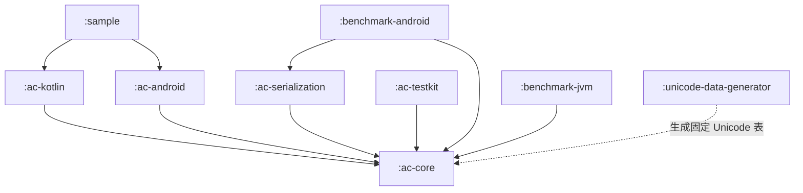
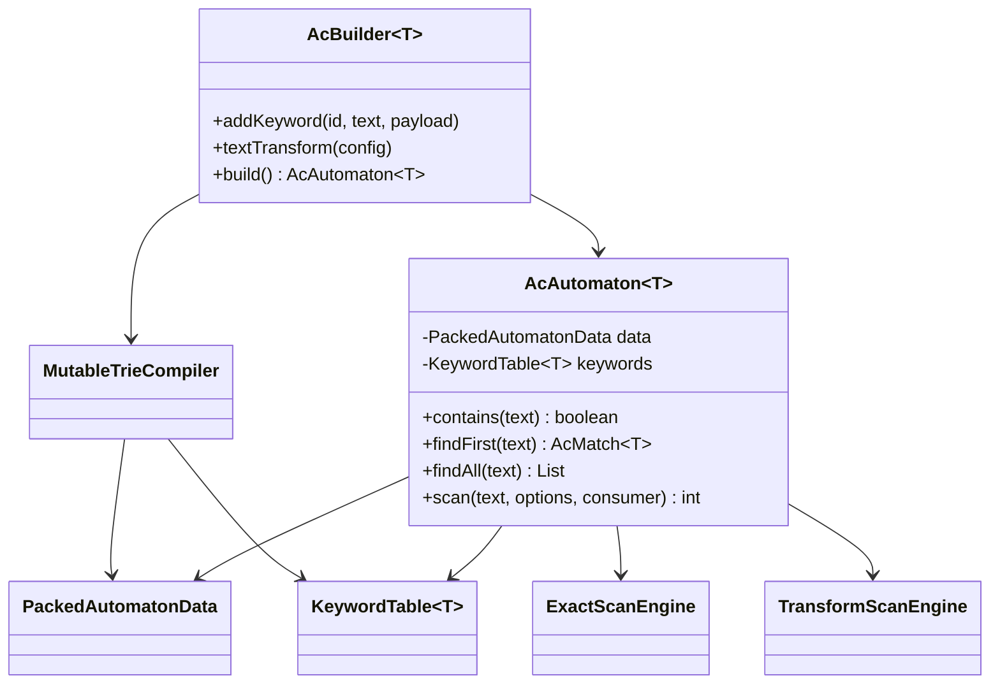
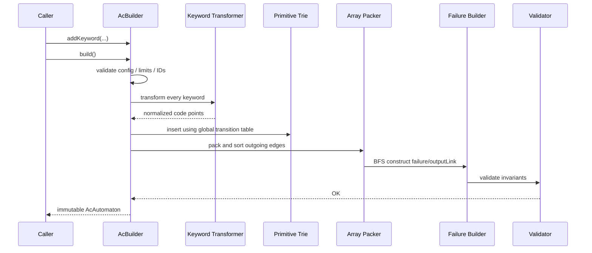

# Aho-Corasick Android 高性能实现需求

> 文档状态：**可直接进入开发（Ready for Development）**  
> 文档版本：**1.0**  
> 编制日期：**2026-09-03**  
> 目标平台：Android / JVM  
> 默认 Android 基线：`minSdk 21`（`ac-core` 不引用 Android API，可在 M0 调整）  
> 对标能力：`org.ahocorasick:ahocorasick:0.6.3`  
> 首版 Unicode 数据基线：**Unicode 17.0.0**  
> 默认索引协议：**UTF-16 半开区间 `[start, end)`**

---

## 1. 文档目的

本文档定义一个面向 Android 的高性能 Aho-Corasick 多模式文本匹配引擎，目标是在覆盖现有 `org.ahocorasick:ahocorasick:0.6.3` 主要能力的基础上，重点解决以下问题：

1. 大词库下 `State + HashMap<Character, State>` 对象数量多、内存占用高、GC 压力大。
2. `char` 级扫描不能完整表达 Unicode supplementary code point。
3. 匹配结果索引、重叠消解、大小写折叠、词边界语义不够明确。
4. `contains`、回调扫描等热路径仍可能产生不必要的对象。
5. 动态更新词库时缺少不可变快照与原子切换模型。
6. 缺少面向 Android 真机的稳定 Benchmark 和发布门槛。

本文档不仅描述“做什么”，同时固定关键语义、核心数据结构、类职责、异常行为、测试矩阵和验收标准，开发人员无需再次设计核心协议即可进入编码。

---

## 2. 规范性用语

本文中的关键字含义如下：

- **MUST / 必须**：发布前必须实现并通过验收。
- **SHOULD / 应当**：默认应实现；若偏离，必须记录架构决策和理由。
- **MAY / 可以**：可选增强能力。
- **P0**：1.0 首发阻塞项。
- **P1**：1.1 增强项，不阻塞 1.0。
- **P2**：后续优化或高级能力。

---

## 3. 总体目标与非目标

### 3.1 产品目标

引擎 MUST 支持：

- 一次构建多个关键词的 Aho-Corasick 自动机。
- 中文、英文、韩文、日文、Emoji 及 supplementary code point。
- 关键词 Payload。
- `contains`、任意首个命中、确定性首个命中、全部命中、低分配回调扫描。
- 重叠匹配和确定性的非重叠匹配。
- 可配置大小写折叠。
- 可配置词边界。
- Tokenize / 高亮切片。
- 构建完成后不可变、多线程安全、无锁查询。
- Android 大词库下较低的常驻内存和扫描分配。
- 与参考朴素实现进行随机差分验证。
- 与 `org.ahocorasick:ahocorasick:0.6.3` 在相同设备、相同数据上的性能对比。

### 3.2 非目标

首版明确不实现：

- 正则表达式。
- 模糊匹配、编辑距离、拼音相似、同音字识别。
- 中文分词、词形还原、语义理解。
- Trie 原地增删节点。
- 分布式词库同步协议。
- 使用 Java 原生对象序列化保存 Payload。
- 将所有 Unicode 视觉等价字符自动视为相同字符。
- 安全领域的 confusable / 同形异义字符检测；该能力应作为独立模块处理。

---

## 4. 核心架构决策

| 编号 | 决策 | 结论 |
|---|---|---|
| ADR-001 | 核心实现语言 | `ac-core` 使用 Java 8 语法子集，确保 Kotlin/Java 双向调用和广泛 Android 兼容；Kotlin 扩展放入独立模块。 |
| ADR-002 | 运行时节点表示 | 使用 `int stateId + primitive arrays`，运行时自动机中禁止保存每节点 `HashMap`。 |
| ADR-003 | 可变性 | Builder 可变且非线程安全；编译后的 `AcAutomaton` 完全不可变且线程安全。 |
| ADR-004 | 扫描单位 | 内部按 Unicode code point 扫描，而不是按 Java `char` 扫描。 |
| ADR-005 | 结果索引 | 对外统一返回原始输入的 UTF-16 半开区间 `[startUtf16, endUtf16)`。 |
| ADR-006 | 默认文本变换 | 默认精确匹配：不规范化、不忽略大小写。所有有损或扩展式变换均需显式开启。 |
| ADR-007 | 大小写无关匹配 | 1.0 支持由固定 Unicode 数据表驱动的一对一 `SIMPLE` case fold；1.1 支持一对多 `FULL` case fold。不得依赖设备运行时字符数据库决定结果。 |
| ADR-008 | 规范化 | NFC/NFKC 为 1.1 能力；关键词和输入必须使用完全相同的变换配置与 Unicode 数据版本。 |
| ADR-009 | 热路径 | `contains` 和 callback `scan` 在精确模式下必须做到引擎侧零临时对象分配。 |
| ADR-010 | 动态词库 | 后台重新构建不可变快照，通过 `AtomicReference` 原子替换，不修改正在使用的自动机。 |
| ADR-011 | 索引兼容 | 不沿用旧库 inclusive end；新 API 固定为 Java/Android 常用的 end-exclusive。 |
| ADR-012 | 构建确定性 | 相同配置、相同关键词 ID 与内容、相同 Unicode 数据版本，应生成行为一致的自动机；序列化开启确定性构建时应产生相同字节。 |

---

## 5. 版本范围与优先级

### 5.1 1.0（P0）

- 精确 code point 匹配。
- `SIMPLE` case fold。
- Payload。
- 全量、任意首个、左侧优先最长首个、contains、callback scan。
- `ALL` 与 `LEFTMOST_LONGEST` 重叠策略。
- `NONE`、`ASCII_WORD`、`UNICODE_ALNUM`、`WHITESPACE`、`CUSTOM` 边界策略。
- Tokenize。
- primitive packed automaton。
- Builder 限额与确定性输出。
- 不可变并发查询。
- 单元测试、随机差分测试、Android Microbenchmark。

### 5.2 1.1（P1）

- NFC、NFKC。
- Unicode full case folding。
- UAX #29 word boundary。
- 自动机二进制快照。
- Android Asset/File 加载器。
- 流式分块扫描。
- Kotlin 扩展 API。

### 5.3 2.x（P2）

- mmap 只读自动机。
- 多级自动机 / 增量 delta dictionary。
- 输出表压缩和可选 16/24-bit 索引。
- SIMD/ASCII 特化探索。
- 自动生成 Baseline Profile。
- 词库编译 Gradle Plugin 或 CLI。

### 5.4 功能需求追踪表

| ID | 需求 | 优先级 | 主要验收位置 |
|---|---|---:|---|
| FR-001 | 批量添加关键词并构建自动机 | P0 | AC-001～AC-010 |
| FR-002 | Payload 与稳定 keywordId | P0 | DUP/API 测试 |
| FR-003 | `contains` 零分配判断 | P0 | Benchmark 分配门槛 |
| FR-004 | `findAny` 快速首个候选 | P0 | API/随机差分 |
| FR-005 | `findFirst` 左侧优先最长语义 | P0 | 属性测试 |
| FR-006 | 全量匹配和稳定排序 | P0 | AC/CN/随机差分 |
| FR-007 | callback 扫描与主动停止 | P0 | API-004/Benchmark |
| FR-008 | ALL/LEFTMOST_LONGEST | P0 | CN-001/CN-002 |
| FR-009 | 内置和自定义词边界 | P0 | CN/Boundary 测试 |
| FR-010 | Tokenize 原文完整覆盖 | P0 | TOK-001～TOK-005 |
| FR-011 | Unicode code point 与 UTF-16 offset | P0 | UNI-001～UNI-006 |
| FR-012 | SIMPLE case fold | P0 | UNI-009 |
| FR-013 | NFC/NFKC/FULL fold | P1 | UNI-007～UNI-011 |
| FR-014 | UAX #29 word boundary | P1 | Unicode 官方测试 |
| FR-015 | 自动机快照与校验 | P1 | Snapshot 测试 |
| FR-016 | 跨 chunk 流式扫描 | P1 | Streaming 测试 |
| FR-017 | 原子替换词库快照 | P0 | 并发测试 |
| NFR-001 | 编译后无每节点 Map/Set | P0 | 结构检查/heap dump |
| NFR-002 | 查询线程安全且无锁 | P0 | 并发测试/代码审查 |
| NFR-003 | 精确 callback 热路径零分配 | P0 | Android Microbenchmark |
| NFR-004 | 相同输入和配置行为确定 | P0 | 顺序重排/快照测试 |
| NFR-005 | 大词库限额与溢出保护 | P0 | Limit 测试 |

---

## 6. Gradle 模块架构



### 6.1 模块职责

| 模块 | 优先级 | 类型 | 职责 | 运行时第三方依赖 |
|---|---:|---|---|---|
| `:ac-core` | P0 | `java-library` | Builder、编译器、packed automaton、扫描器、匹配策略、Payload、Tokenize | 无 |
| `:ac-kotlin` | P1 | Kotlin/JVM | Kotlin DSL、sequence/flow 适配、nullable 友好封装 | Kotlin stdlib |
| `:ac-serialization` | P1 | `java-library` | 自动机快照编码、校验、版本迁移、Payload codec | 无或仅项目批准依赖 |
| `:ac-android` | P1 | Android Library | Assets/File 加载、Atomic repository、主线程保护、Android 日志适配 | AndroidX annotations 可选 |
| `:ac-testkit` | P0 | 测试库 | 朴素参考匹配器、随机词库、差分测试、数据集生成器 | 测试依赖可用 |
| `:benchmark-android` | P0 | Android Benchmark | 真机 Microbenchmark、内存与分配测试、与旧库对比 | AndroidX Benchmark |
| `:benchmark-jvm` | P1 | JVM Benchmark | 开发阶段快速回归，不作为 Android 发布唯一依据 | JMH，可选 |
| `:unicode-data-generator` | P0/P1 | 构建工具 | 从固定 Unicode 数据版本生成 SIMPLE fold、字符属性；P1 再生成 normalization、FULL fold、UAX #29 表 | 构建期依赖可用，产物不得引入运行时依赖 |
| `:sample` | P0 | Android App | Java/Kotlin 使用示例、动态快照切换、关键词高亮 | 项目模块 |

### 6.2 依赖约束

`ac-core` MUST：

- 不依赖 Android Framework。
- 不依赖 Kotlin runtime。
- 不依赖反射。
- 不依赖 Java Serialization。
- 不在扫描热路径使用 Stream API、集合迭代器、lambda 捕获对象或装箱类型。
- 不创建内部线程池；调度权归调用方。
- 不通过设备的 `Character`/ICU 数据版本隐式决定 SIMPLE fold、Unicode 属性或 whitespace 语义；这些规则必须由固定版本生成表驱动，ASCII 可走手写快路径。

---

## 7. 推荐源码目录

```text
ac-core/
└── src/main/java/com/yourorg/ac/
    ├── AcAutomaton.java
    ├── AcBuilder.java
    ├── AcKeyword.java
    ├── AcMatch.java
    ├── AcMatchConsumer.java
    ├── AcScanOptions.java
    ├── AcScanContext.java
    ├── AcToken.java
    ├── AcStats.java
    ├── MatchDecision.java
    ├── MatchLimitAction.java
    ├── EmissionOrder.java
    ├── OverlapPolicy.java
    ├── BoundaryPolicy.java
    ├── Boundaries.java
    ├── TextTransformConfig.java
    ├── NormalizationMode.java
    ├── CaseFoldMode.java
    ├── InvalidSurrogatePolicy.java
    ├── DuplicateKeywordPolicy.java
    ├── OriginalKeywordPolicy.java
    ├── OutputEncoding.java
    ├── BuildLimits.java
    ├── stream/                  // P1
    │   ├── AcLongMatchConsumer.java
    │   └── AcStreamingSession.java
    ├── exception/
    │   ├── AcBuildException.java
    │   ├── AcLimitExceededException.java
    │   ├── DuplicateKeywordException.java
    │   ├── InvalidUnicodeException.java
    │   ├── AcMatchLimitExceededException.java
    │   └── CorruptAutomatonException.java
    └── internal/
        ├── MutableTrieCompiler.java
        ├── PackedAutomatonData.java
        ├── LongIntTransitionTable.java
        ├── IntArrayQueue.java
        ├── IntVector.java
        ├── CodePointCursor.java
        ├── ExactScanEngine.java
        ├── TransformScanEngine.java
        ├── CandidateEmitter.java
        ├── LeftmostLongestResolver.java
        ├── BoundaryChecker.java
        ├── KeywordTable.java
        └── AutomatonValidator.java
```

包名 `com.yourorg.ac` 是占位符，项目启动时只需一次性替换，不影响本文其余设计。

---

## 8. 公共接口定义与 API 设计

### 8.1 `AcAutomaton<T>`

```java
public final class AcAutomaton<T> {

    public static <T> AcBuilder<T> builder();

    /**
     * 只判断是否存在任意有效匹配。
     * 精确模式下不得创建 Match 或集合对象。
     */
    public boolean contains(CharSequence text);

    public boolean contains(
            CharSequence text,
            AcScanOptions options);

    /**
     * 返回扫描过程中遇到的任意首个有效候选，偏重速度。
     * 结果不承诺 leftmost-longest；无匹配返回 null。
     */
    public AcMatch<T> findAny(CharSequence text);

    public AcMatch<T> findAny(
            CharSequence text,
            AcScanOptions options);

    /**
     * 确定性首个结果：start 最小；start 相同时长度最长；
     * 仍相同时 keywordId 最小。无匹配返回 null。
     */
    public AcMatch<T> findFirst(CharSequence text);

    public AcMatch<T> findFirst(
            CharSequence text,
            AcScanOptions options);

    /** 默认按 START_ASC_LENGTH_DESC_ID_ASC 返回。 */
    public List<AcMatch<T>> findAll(CharSequence text);

    public List<AcMatch<T>> findAll(
            CharSequence text,
            AcScanOptions options);

    /**
     * 低分配扫描。返回实际传递给 consumer 的匹配数量。
     * consumer 返回 STOP 时立即终止。
     */
    public int scan(
            CharSequence text,
            AcScanOptions options,
            AcMatchConsumer<? super T> consumer);

    /**
     * 允许调用方复用 offset/normalization scratch，适合高频或变换扫描。
     */
    public int scan(
            CharSequence text,
            AcScanOptions options,
            AcScanContext context,
            AcMatchConsumer<? super T> consumer);

    /**
     * 生成原文切片 Token。默认使用 LEFTMOST_LONGEST，
     * Token 只保存 offset，不复制字符串内容。
     */
    public List<AcToken<T>> tokenize(
            CharSequence text,
            AcScanOptions options);

    public AcKeyword<T> keywordById(int keywordId);

    public AcStats stats();
}
```

### 8.2 `AcBuilder<T>`

```java
public final class AcBuilder<T> {

    /** 自动分配非负 keywordId。 */
    public AcBuilder<T> addKeyword(String keyword, T payload);

    /** 显式 keywordId 必须非负且唯一。 */
    public AcBuilder<T> addKeyword(
            int keywordId,
            String keyword,
            T payload);

    public AcBuilder<T> addKeywords(
            Iterable<? extends AcKeyword<T>> keywords);

    public AcBuilder<T> textTransform(TextTransformConfig config);

    public AcBuilder<T> duplicatePolicy(
            DuplicateKeywordPolicy policy);

    public AcBuilder<T> originalKeywordPolicy(
            OriginalKeywordPolicy policy);

    public AcBuilder<T> outputEncoding(OutputEncoding encoding);

    public AcBuilder<T> limits(BuildLimits limits);

    public AcBuilder<T> deterministicBuild(boolean enabled);

    public AcAutomaton<T> build();
}
```

Builder 生命周期固定为 one-shot：首次 `build()` 成功或失败后即进入 CLOSED 状态；后续 add/config/build 调用抛 `IllegalStateException`。需要重建快照时创建新的 Builder，避免复用半构建状态。

### 8.3 `AcMatchConsumer<T>`

```java
@FunctionalInterface
public interface AcMatchConsumer<T> {
    MatchDecision onMatch(
            int startUtf16,
            int endUtf16,
            int keywordId,
            T payload);
}
```

该接口不得强制创建 `AcMatch`。Kotlin SAM 调用时，使用方应避免捕获大对象。

### 8.4 `AcMatch<T>`

```java
public final class AcMatch<T> {
    private final int startUtf16;
    private final int endUtf16;
    private final int keywordId;
    private final T payload;

    public int startUtf16();
    public int endUtf16();
    public int lengthUtf16();
    public int keywordId();
    public T payload();
}
```

强制不变量：

```text
0 <= startUtf16 <= endUtf16 <= input.length()
```

### 8.5 `AcKeyword<T>`

```java
public final class AcKeyword<T> {
    private final int keywordId;
    private final String originalText; // DROP 模式下可为 null
    private final T payload;

    public int keywordId();
    public String originalText();
    public T payload();
}
```

### 8.6 `AcScanOptions`

```java
public final class AcScanOptions {
    public static final AcScanOptions ALL;
    public static final AcScanOptions LEFTMOST_LONGEST;

    public OverlapPolicy overlapPolicy();
    public BoundaryPolicy boundaryPolicy();
    public EmissionOrder emissionOrder();
    public int maxMatches();
    public MatchLimitAction matchLimitAction();

    public static Builder builder();

    public static final class Builder {
        public Builder overlapPolicy(OverlapPolicy value);
        public Builder boundaryPolicy(BoundaryPolicy value);
        public Builder emissionOrder(EmissionOrder value);
        public Builder maxMatches(int value);
        public Builder matchLimitAction(MatchLimitAction value);
        public AcScanOptions build();
    }
}
```

`AcScanOptions` MUST 不可变且可跨线程复用。默认 `maxMatches=Integer.MAX_VALUE`，处理不可信长文本时调用方 SHOULD 显式设置上限。

字段适用规则：

| API | 使用的 options 字段 |
|---|---|
| `contains` | `boundaryPolicy`；其他字段忽略 |
| `findAny` | `boundaryPolicy`；其他字段忽略 |
| `findFirst` | `boundaryPolicy`；比较器固定为 leftmost-longest-ID |
| `findAll` | 全部字段 |
| `scan` | 全部字段 |
| `tokenize` | `boundaryPolicy/maxMatches/matchLimitAction`；`overlapPolicy` 必须为 `LEFTMOST_LONGEST`，否则抛 `IllegalArgumentException` |

### 8.7 `TextTransformConfig`

```java
public final class TextTransformConfig {
    public static TextTransformConfig exact();
    public static Builder builder();

    public NormalizationMode normalization();
    public CaseFoldMode caseFold();
    public InvalidSurrogatePolicy invalidKeywordSurrogatePolicy();
    public InvalidSurrogatePolicy invalidInputSurrogatePolicy();
    public String unicodeVersion();
    public long fingerprint();

    public static final class Builder {
        public Builder normalization(NormalizationMode value);
        public Builder caseFold(CaseFoldMode value);
        public Builder invalidKeywordSurrogatePolicy(InvalidSurrogatePolicy value);
        public Builder invalidInputSurrogatePolicy(InvalidSurrogatePolicy value);
        public TextTransformConfig build();
    }
}
```

`unicodeVersion` 由库构建时固定，业务调用方不能随意伪造。`fingerprint` 必须覆盖 Unicode 版本、变换顺序、所有模式和生成表版本。

### 8.8 Boundary 工厂

```java
public final class Boundaries {
    public static final BoundaryPolicy NONE;
    public static final BoundaryPolicy ASCII_WORD;
    public static final BoundaryPolicy UNICODE_ALNUM;
    public static final BoundaryPolicy WHITESPACE;

    // P1
    public static final BoundaryPolicy UAX29_WORD;

    private Boundaries() {}
}
```

### 8.9 `AcScanContext`

```java
public final class AcScanContext {
    public AcScanContext();
    public void clear();
    public int retainedIntCapacity();
}
```

- 用于复用 code-point offset ring、normalization buffer 和 overlap 候选缓冲。
- 非线程安全；一个 context 同时只能服务一次 scan。实现应使用 in-use 标记检测并发或递归复用，并抛 `IllegalStateException`。
- `clear()` 清理逻辑状态但保留容量。
- 精确模式不要求 context；变换或高命中场景 SHOULD 复用 context。

### 8.10 `AcStats`

```java
public final class AcStats {
    public int keywordCount();
    public int stateCount();
    public int edgeCount();
    public int ownOutputCount();
    public int maxDepthCodePoint();
    public int maxKeywordCodePointLength();
    public long estimatedPrimitiveBytes();
    public String unicodeVersion();
    public long transformFingerprint();
}
```

### 8.11 枚举定义

```java
public enum OverlapPolicy {
    ALL,
    LEFTMOST_LONGEST
}

public enum EmissionOrder {
    DETECTION,
    START_ASC_LENGTH_DESC_ID_ASC
}

public enum CaseFoldMode {
    NONE,
    SIMPLE,
    FULL // P1
}

public enum NormalizationMode {
    NONE,
    NFC,  // P1
    NFKC  // P1
}

public enum InvalidSurrogatePolicy {
    REJECT,
    REPLACE
}

public enum DuplicateKeywordPolicy {
    KEEP_ALL,
    REJECT_NORMALIZED,
    KEEP_FIRST,
    KEEP_LAST
}

public enum OriginalKeywordPolicy {
    KEEP,
    DROP
}

public enum OutputEncoding {
    LINKED,
    FLATTENED
}

public enum MatchDecision {
    CONTINUE,
    STOP
}

public enum MatchLimitAction {
    STOP,
    THROW
}
```

---

## 9. 类设计与职责

### 9.1 公共类

| 类 | 主要职责 | 可变性 | 线程安全 |
|---|---|---:|---:|
| `AcBuilder<T>` | 收集配置与关键词，编译自动机 | 可变 | 否 |
| `AcAutomaton<T>` | 持有 packed arrays 和关键词表，提供查询 API | 不可变 | 是 |
| `AcMatch<T>` | 单个匹配结果 | 不可变 | 是 |
| `AcKeyword<T>` | 关键词元数据 | 不可变 | 取决于 Payload；容器本身是 |
| `AcScanOptions` | 本次扫描策略 | 不可变 | 是 |
| `TextTransformConfig` | 构建和扫描共用的文本变换协议 | 不可变 | 是 |
| `BoundaryPolicy` | 边界判定 | 内置实现不可变 | 内置实现是；自定义实现由调用方保证 |
| `AcStats` | 状态数、边数、输出数、最大深度、估算字节数 | 不可变 | 是 |

### 9.2 内部类

| 类 | 职责 |
|---|---|
| `MutableTrieCompiler` | 验证、规范化关键词、构造 primitive Trie、BFS failure、打包数组 |
| `LongIntTransitionTable` | 构建阶段保存 `(stateId, codePoint) -> targetState`，使用 open addressing，避免每节点 Map |
| `PackedAutomatonData` | 保存运行时 primitive arrays |
| `ExactScanEngine` | 无规范化热路径；按 code point 扫描并直接映射 UTF-16 offset |
| `TransformScanEngine` | 处理 case fold / normalization 及 offset mapping |
| `LeftmostLongestResolver` | 使用有界候选缓冲实现确定性的非重叠选择 |
| `BoundaryChecker` | 内置和自定义边界策略适配 |
| `KeywordTable<T>` | dense slot、外部 keywordId、长度、Payload、可选原词 |
| `AutomatonValidator` | 构建后验证数组边界、failure 深度、边排序、输出引用 |
| `CodePointCursor` | 正确处理 surrogate pair 和未配对 surrogate |

### 9.3 关系图



---

## 10. 运行时数据结构

### 10.1 状态与边

状态 ID 使用连续 `int`：

```text
rootStateId = 0
其他状态 = 1..stateCount-1
```

`PackedAutomatonData` 至少包含：

```java
final int[] failure;          // [state] -> failure state
final int[] firstEdge;        // [state] -> edgeCodePoint 起始索引
final int[] edgeCount;        // [state] -> 出边数量
final int[] outputLink;       // [state] -> 最近的、具有 own output 的 failure 祖先；无则 -1
final int[] ownOutputStart;   // [state] -> ownOutputKeywordSlot 起始索引
final int[] ownOutputCount;   // [state] -> 本状态直接输出数量

final int[] edgeCodePoint;    // 所有边，按每个状态内部 code point 升序
final int[] edgeTarget;       // 与 edgeCodePoint 一一对应

final int[] ownOutputKeywordSlot;

final int[] rootAsciiTarget;  // 固定长度 128；无边为 -1，可选但默认开启
```

关键词表至少包含：

```java
final int[] keywordIdBySlot;
final int[] keywordLengthCodePoint;
final int[] keywordLengthUtf16Exact; // 仅 exact fast path 使用
final int[] keywordIdSorted;         // keywordById 二分查找
final int[] keywordSlotBySortedId;
final Object[] payloadBySlot;
final String[] originalKeywordBySlot; // DROP 模式下整个数组可不存在
```

### 10.2 强制不变量

- `failure.length == stateCount`。
- `failure[0] == 0`。
- 非根状态的 failure 深度严格小于本状态深度。
- `firstEdge[state] + edgeCount[state] <= edgeCodePoint.length`。
- 同一状态内 `edgeCodePoint` 严格递增。
- 同一 `(state, codePoint)` 最多一条边。
- `edgeTarget` 必须在 `[0, stateCount)`。
- `outputLink[state] == -1` 或引用合法状态。
- output slot 必须在 `[0, keywordCount)`。
- `keywordIdSorted` 严格递增，`keywordSlotBySortedId` 与其一一对应。
- 关键词规范化后的 code point 长度必须大于 0。
- 所有数组在 `AcAutomaton` 构造完成后不再修改或泄露可写引用。

### 10.3 运行时内存估算

在 `LINKED` 输出模式下，不计数组对象头、Payload 和保留原词，主要 primitive 数据近似为：

```text
状态数组：6 * 4 * S = 24S bytes
边数组：  2 * 4 * E = 8E bytes
输出数组：1 * 4 * O = 4O bytes
关键词元数据：5 * 4 * K = 20K bytes
root ASCII 表：512 bytes
```

其中：

- `S`：状态数。
- `E`：边数；Trie 中通常约等于 `S - 1`。
- `O`：关键词直接输出数量。
- `K`：关键词条目数量。

`FLATTENED` 模式会复制 failure 祖先输出，扫描更快，但可能显著增大 `O`。默认 MUST 使用 `LINKED`。

### 10.4 转移查询策略

`goto(state, cp)` MUST 使用以下混合策略：

1. `state == 0 && cp < 128`：直接查询 `rootAsciiTarget[cp]`。
2. 出度 `<= LINEAR_THRESHOLD`：线性扫描；默认阈值初始设为 6，最终由 Benchmark 固化。
3. 出度 `> LINEAR_THRESHOLD`：在该状态有序边区间内二分查找。
4. 禁止在运行时创建 Map 或 Character 对象。

阈值属于内部实现细节，不进入公共 API。

---

## 11. 构建阶段数据结构

### 11.1 全局 primitive 转移表

构建阶段禁止为每个状态创建一个 `HashMap`。使用全局 open-addressed 表：

```text
key = ((long) stateId << 21) | codePoint
value = targetStateId
```

理由：Unicode code point 最大只占 21 bit，剩余高位用于 stateId。

`LongIntTransitionTable` 要求：

- 空槽使用独立状态数组或保留 sentinel，不允许合法 key 与 sentinel 冲突。
- 装载因子默认不高于 0.70。
- 扩容必须检查整数溢出和 BuildLimits。
- 查找、插入不得装箱。
- 构建打包完成后立即释放该表引用。

### 11.2 构建期状态池

至少包含动态 primitive 数组：

```java
int[] stateDepth;
int[] firstOwnOutputNode;

int[] outputKeywordSlot;
int[] nextOutputNode;
```

禁止递归遍历 Trie；所有深度遍历使用显式队列，避免超长关键词引发栈溢出。

---

## 12. 构建流程



### 12.1 详细步骤

1. 冻结构建配置快照。
2. 验证 keywordId 唯一、关键词非空、配置组合合法。
3. 按 `InvalidSurrogatePolicy` 解析关键词。
4. 对关键词应用与运行时完全相同的 `TextTransformConfig`。
5. 若变换后为空，构建失败。
6. 执行规范化重复词策略。
7. 若 `deterministicBuild=true`，按以下键排序后插入：
   - 规范化 code point 序列字典序；
   - keywordId 升序。
8. 使用 primitive transition table 插入 Trie。
9. 统计每状态出度，使用 prefix sum 分配 packed edge arrays。
10. 填充并按每状态 code point 升序排序。
11. 对根节点的直接子状态设置 `failure=0`。
12. BFS 构造其余 failure。
13. 构造 `outputLink`，不复制祖先输出。
14. 每个 own-output 区间按：
    - 规范化长度降序；
    - keywordId 升序。
15. 生成 `rootAsciiTarget`。
16. 执行 `AutomatonValidator`。
17. 释放构建临时表。
18. 创建所有字段均为 `final` 的 `AcAutomaton`。

### 12.2 Failure 构建伪代码

```text
queue = all direct children of root
for child in queue:
    failure[child] = root
    outputLink[child] = -1

while queue not empty:
    r = queue.remove()

    for each edge (cp -> s) of r:
        queue.add(s)
        f = failure[r]

        while f != root and goto(f, cp) == NONE:
            f = failure[f]

        candidate = goto(f, cp)
        if candidate != NONE and candidate != s:
            failure[s] = candidate
        else:
            failure[s] = root

        fs = failure[s]
        if ownOutputCount[fs] > 0:
            outputLink[s] = fs
        else:
            outputLink[s] = outputLink[fs]
```

---

## 13. 扫描流程

### 13.1 精确匹配热路径

```text
state = root
utf16Index = 0
codePointIndex = 0

while utf16Index < text.length:
    cp, nextUtf16Index = readCodePoint(text, utf16Index)
    remember source span in ring buffer

    while state != root and goto(state, cp) == NONE:
        state = failure[state]

    next = goto(state, cp)
    state = next != NONE ? next : root

    emit own outputs of state
    follow outputLink and emit inherited outputs

    utf16Index = nextUtf16Index
    codePointIndex++
```

### 13.2 Offset 计算与 ring buffer

精确模式下，匹配到的原文 UTF-16 序列与关键词完全一致，因此 MUST 使用 `keywordLengthUtf16Exact` 直接执行 `start = end - lengthUtf16`；该路径不需要 ring buffer，是零分配主路径。

SIMPLE fold、normalization 或 FULL fold 下，变换后长度不能可靠替代原文 UTF-16 长度。扫描器应通过以下两种方式之一取得 start：

1. 调用方传入可复用 `AcScanContext`，保存最近 `maxKeywordCodePointLength` 个 transformed code point 的源区间；这是高频推荐路径。
2. SIMPLE fold 且未提供 context 时，可从 end 位置向前无分配遍历对应数量的原始 code point；该回退保持正确与零分配，但密集命中时可能更慢。

通用 ring buffer：

```java
int[] sourceStartUtf16Ring;
int[] sourceEndUtf16Ring;
```

候选长度为 `L`，当前 transformed code point 序号为 `p` 时：

```text
start = sourceStart[(p - L + 1) mod ringSize]
end   = sourceEnd[p mod ringSize]
```

在 expansion mapping 中，多个输出 code point 可以映射到同一原始源区间；上述协议仍可返回覆盖完整原文的保守区间。

### 13.3 Fast path 分派

`AcAutomaton.scan` MUST 在进入字符循环前只分派一次：

```text
Exact + no boundary + ALL（UTF-16 长度直接回算）
Simple fold + no boundary + ALL（无 context 回退或 context ring）
Exact + built-in boundary
Generic transformed path
```

不得在每个 code point 内反复判断所有配置开关。

### 13.4 扫描复杂度

- 构建：与关键词总 code point 数、边排序及 failure 构建相关。
- 扫描：近似 `O(N * transitionLookup + Z)`。
- `N` 为 transformed code point 数。
- `Z` 为候选输出数。
- 即使输入扫描近线性，输出数量仍可能呈爆炸式增长，因此 MUST 支持 `maxMatches` 和 consumer 主动停止。

---

## 14. 匹配语义

### 14.1 索引协议

所有公开 API MUST 返回原始 `CharSequence` 上的 UTF-16 半开区间：

```text
[startUtf16, endUtf16)
```

因此可以直接执行：

```java
text.subSequence(match.startUtf16(), match.endUtf16());
```

### 14.2 空输入与空关键词

- 空输入：返回无匹配；`contains=false`；不得抛异常。
- 空关键词：禁止添加，抛 `IllegalArgumentException`。
- 变换后为空的关键词：禁止构建，抛带错误码的 `AcBuildException`。

### 14.3 重复关键词

“重复”以**变换后的 code point 序列**判断，而不是仅比较原字符串。

例如在 NFKC 模式下，全角和半角文本可能变为同一序列。

策略：

- `KEEP_ALL`：保留所有 keywordId/Payload；同一区间可产生多个结果。
- `REJECT_NORMALIZED`：发现重复立即构建失败。
- `KEEP_FIRST`：按添加顺序保留第一项。
- `KEEP_LAST`：按添加顺序保留最后一项。

keywordId 无论使用何种策略都不得重复。

### 14.4 候选检测顺序

`EmissionOrder.DETECTION` 的顺序固定为：

1. `endUtf16` 升序。
2. 同一结束位置时，规范化关键词长度降序，即更早的 start 先出。
3. 长度相同时，keywordId 升序。

该顺序独立于 Hash 表迭代顺序。

### 14.5 `findAny`

- 返回扫描过程中遇到的第一个**通过边界校验**的候选。
- 偏重最快终止。
- 不保证是全局最左、最长结果。
- `contains` MUST 复用同一快速路径，但不得创建 `AcMatch`。

### 14.6 `findFirst`

结果比较器固定为：

```text
startUtf16 最小
→ endUtf16 最大（同 start 时最长）
→ keywordId 最小
```

该行为不得因关键词添加顺序改变。

### 14.7 `ALL`

保留所有通过变换与边界规则的结果，包括：

- 嵌套结果。
- 相交结果。
- 同一区间不同 keywordId 的结果。

`findAll` 默认最终排序：

```text
startUtf16 升序
→ lengthUtf16 降序
→ keywordId 升序
```

### 14.8 `LEFTMOST_LONGEST`

定义为迭代选择：

1. 在未被前一结果覆盖的候选中，选择最小 start。
2. start 相同，选择最大 end。
3. start/end 相同，选择最小 keywordId。
4. 选中 `[s, e)` 后，丢弃所有满足 `candidate.start < e` 的候选。
5. 从 `e` 之后继续。

示例：

```text
关键词：微信、微信支付、支付
文本：微信支付支付

ALL：
[0,2) 微信
[0,4) 微信支付
[2,4) 支付
[4,6) 支付

LEFTMOST_LONGEST：
[0,4) 微信支付
[4,6) 支付
```

### 14.9 有界左侧优先缓冲

为避免 `LEFTMOST_LONGEST` 必须缓存全文结果，扫描器可使用 `maxKeywordCodePointLength`：

- 记录当前最早 start 的最佳候选。
- 当扫描位置已经超过“该 start 仍可能形成更长关键词”的最远位置时，即可确定并发出结果。
- 缓冲大小必须与最大关键词长度和局部候选数量相关，而不是与全文长度相关。
- 若 `EmissionOrder.START_ASC...` 与 `ALL` 同时开启，可以物化并排序；该模式不承诺零分配。

### 14.10 Tokenize

`tokenize` MUST：

- 只接受 `LEFTMOST_LONGEST`；传入其他 overlapPolicy 时抛 `IllegalArgumentException`，不静默改写调用方选项。
- 覆盖原文完整区间 `[0, text.length())`。
- 不丢字符、不重复字符。
- 生成 `MATCH` 与 `FRAGMENT` 两类 Token。
- Token 只保存原文 offset 和匹配元数据，不复制 fragment 字符串。

```java
public final class AcToken<T> {
    public enum Type { MATCH, FRAGMENT }
    public Type type();
    public int startUtf16();
    public int endUtf16();
    public int keywordId(); // FRAGMENT 时为 -1
    public T payload();     // FRAGMENT 时为 null
}
```

---

## 15. Unicode 规则

### 15.1 基本原则

Java `String` 使用 UTF-16；supplementary character 由 surrogate pair 表示，单个 `char` 只是 UTF-16 code unit。因此内部扫描 MUST 使用 code point API 或等价的手写无分配实现，不能把每个 `char` 都当成完整字符。[R3][R4]

### 15.2 Unicode 版本固定

- 1.0/1.1 的生成表和测试数据基线固定为 Unicode 17.0.0。
- 编译产物、序列化快照和 `AcStats` MUST 记录 Unicode 数据版本。
- 不得在同一自动机中混用不同 Unicode 版本生成的 case-fold、normalization 或 word-boundary 表。
- Unicode 版本升级属于可观察行为变更，必须进入 release note 并运行完整兼容测试。

### 15.3 未配对 surrogate

关键词和输入分别配置策略：

```java
TextTransformConfig.builder()
    .invalidKeywordSurrogatePolicy(REJECT)
    .invalidInputSurrogatePolicy(REPLACE)
```

默认：

- 关键词：`REJECT`，构建时报错并给出 UTF-16 位置。
- 输入：`REPLACE`，将每个未配对 surrogate 视为 U+FFFD，并保留原始 1 个 UTF-16 code unit 的 source span。

禁止静默跳过未配对 surrogate，因为跳过会破坏 offset 映射并可能制造跨字符误匹配。

### 15.4 文本变换管线

顺序固定为：

```text
原始 code point
→ invalid-surrogate handling
→ pre-normalization（NONE/NFC/NFKC）
→ case folding（NONE/SIMPLE/FULL）
→ post-normalization（配置了 NFC/NFKC 时再次应用同一形式）
→ 自动机
```

再次规范化用于保证 case-fold 扩展后仍处于所声明的规范化形式。若未来实现 Unicode 定义的专用 NFKC_Casefold，必须作为独立、带版本指纹的模式加入，不能悄悄改变现有 NFKC + FULL 语义。

关键词与待扫描文本必须使用相同顺序。

### 15.5 Normalization

Unicode 定义 NFC/NFD/NFKC/NFKD 四种标准规范化形式；本项目只暴露 NFC 和 NFKC。[R1]

- `NONE`：不规范化，P0 默认。
- `NFC`：规范等价合并，P1。
- `NFKC`：兼容等价合并，P1；可能把宽度、圈号等兼容字符归并，必须显式开启。
- NFKC 可能改变字符数量或语义表现，不应作为所有业务的默认值。

### 15.6 Case folding

Unicode case folding 分为：

- `SIMPLE`：一对一 code point 映射。
- `FULL`：允许一对多映射，例如某些单字符可能折叠为多个 code point。[R5][R6]

要求：

- `NONE`：默认。
- `SIMPLE`：P0，必须由固定 Unicode `CaseFolding.txt` 生成的一对一表驱动；仅 ASCII 可使用等价手写快路径。禁止直接依赖设备 `Character.toLowerCase` 的 Unicode 数据版本。
- `FULL`：P1，使用固定 Unicode `CaseFolding.txt` 生成表，不调用设备区域设置。
- 禁止直接使用用户 Locale 做默认转换；土耳其语等 locale-sensitive 行为应由未来独立策略提供。

### 15.7 Offset mapping

通用 transformer 输出：

```java
interface TransformedCodePointConsumer {
    void accept(
        int transformedCodePoint,
        int sourceStartUtf16,
        int sourceEndUtf16);
}
```

映射规则：

- 一对一：输出映射到原 code point 的 UTF-16 span。
- 一对多：所有扩展输出映射到同一原始 span。
- 多对一：合并输出映射到完整输入组合 span。
- 一个 transformed 匹配对应的原文结果为首个输出的 source start 到最后输出的 source end。
- source spans 必须单调不回退。
- 规范化后返回的原文区间允许是“保守覆盖”，但不得遗漏参与匹配的原始 code unit。

### 15.8 Grapheme cluster

Aho-Corasick 的匹配单位是 code point，不是“用户感知字符”。Emoji ZWJ 序列、组合字符和旗帜可能由多个 code point 组成。UAX #29 定义 grapheme、word、sentence 等文本分段边界。[R2]

本项目：

- 不把 grapheme cluster 当作 Trie 边。
- 关键词按相同 code point 序列即可匹配完整 Emoji 序列。
- 若 UI 高亮要求不得切开 grapheme cluster，应在展示层使用 UAX #29 grapheme boundary 对匹配范围做扩展；该行为不属于核心匹配结果修改。

### 15.9 Unicode 数据生成与复现

`:unicode-data-generator` MUST：

- 使用 Unicode 17.0.0 的正式数据文件，不使用 beta 文件。数据文件应提交到受控工具目录或从带 SHA-256 校验的构建缓存取得；普通构建不得依赖联网下载。
- 在仓库记录每个输入文件的 SHA-256。
- 生成代码时输出 Unicode 版本、生成器版本和输入校验和。
- 生成结果必须可重复；CI 重新生成后若存在 diff，构建失败。
- P0 至少生成 SIMPLE case-fold、General_Category/派生 word-char 属性和 White_Space 表。
- P1 增加 FULL case-fold、normalization 数据和 UAX #29 word-break 数据。
- Android/JVM 运行时只读取生成后的紧凑表，不联网、不根据设备版本切换语义。

### 15.10 Unicode 能力分级

| 能力 | 1.0 | 1.1 |
|---|---:|---:|
| supplementary code point | 必须 | 必须 |
| UTF-16 原文 offset | 必须 | 必须 |
| 未配对 surrogate 策略 | 必须 | 必须 |
| simple case fold | 必须 | 必须 |
| full case fold | — | 必须 |
| NFC/NFKC | — | 必须 |
| UAX #29 word boundary | — | 必须 |
| grapheme-aware UI expansion | 示例层 | 示例层 |

---

## 16. 词边界规则

### 16.1 默认策略

默认 `BoundaryPolicy.NONE`。中文敏感词、短语匹配等场景不应隐式使用英文式 whole-word 规则。

### 16.2 内置策略

| 策略 | 优先级 | 规则 |
|---|---:|---|
| `NONE` | P0 | 不检查边界。 |
| `ASCII_WORD` | P0 | `[A-Za-z0-9_]` 视为 word char；命中前后不能是 word char。 |
| `UNICODE_ALNUM` | P0 | 固定 Unicode 17 表中的 Letter、Mark、Decimal Digit、Connector Punctuation 视为 word char。 |
| `WHITESPACE` | P0 | 左右必须是文本边界或固定 Unicode 17 White_Space 属性。 |
| `UAX29_WORD` | P1 | 按固定 Unicode 版本的 UAX #29 default word boundary。 |
| `CUSTOM` | P0 | 调用业务提供的策略。 |

### 16.3 自定义接口

```java
public interface BoundaryPolicy {
    boolean isValid(
        CharSequence originalText,
        int startUtf16,
        int endUtf16);
}
```

要求：

- 调用仅发生在 AC 候选产生后，不在每个字符上调用。
- 实现 SHOULD 无状态、无分配、线程安全。
- 自定义策略抛出的 RuntimeException 原样向上传播。
- 边界检查基于映射回原文后的 `[start, end)`。

### 16.4 中文注意事项

`UNICODE_ALNUM` 会将相邻汉字通常视为同一连续 word 区域，因此可能拒绝中文句子内部的子串命中。中文业务默认应使用 `NONE` 或自定义标点/空白边界规则。

---

## 17. 输出存储策略

### 17.1 `LINKED`（默认）

每个状态只保存直接结束于该状态的关键词，通过 `outputLink` 访问 failure 祖先输出。

优点：

- 避免复制祖先输出。
- 词库存在大量后缀关系时节省内存。

缺点：

- 每次命中可能多次追踪 outputLink。

### 17.2 `FLATTENED`

构建时把 failure 祖先输出合并到状态输出表。

优点：

- 命中路径更直接。

缺点：

- 输出表可能显著膨胀。

要求：

- P0 公共枚举可以预留 `FLATTENED`；若尚未实现，Builder 必须在 build 前明确抛 `UnsupportedOperationException`，不能静默降级。
- P1 若实现，必须单独做内存与扫描 Benchmark。

---

## 18. Payload 与关键词存储

### 18.1 Payload

- Payload 可为 `null`，以支持只需要 keywordId 的场景。
- 引擎不复制、不序列化、不校验 Payload 内部状态。
- 自动机线程安全不代表可变 Payload 线程安全；调用方负责 Payload 的不可变性或同步。
- 自动机持有 Payload 强引用，直到自动机不可达。

### 18.2 keywordId

- keywordId 必须为非负 `int`。
- 显式 keywordId 必须全局唯一。
- 自动 ID 从 0 开始寻找未使用值。
- 混用显式和自动 ID 时，自动分配器必须跳过已占用 ID。
- 运行时输出表保存 dense slot，不使用稀疏 keywordId 直接索引数组。
- `keywordById` 通过按 ID 排序的两个 primitive 数组二分查找，不创建运行时 HashMap。

### 18.3 原始关键词

- `OriginalKeywordPolicy.KEEP`：默认，兼容旧库按结果查看关键词的使用方式。
- `DROP`：不保留原词，降低大词库内存；调用者通过 keywordId/Payload 识别结果。
- `DROP` 不影响匹配，因为 Trie 已保存变换后的路径和长度。

---

## 19. 线程模型

### 19.1 线程安全边界

| 对象 | 线程安全 | 规则 |
|---|---:|---|
| `AcBuilder` | 否 | 只允许单线程添加和构建。 |
| `AcAutomaton` | 是 | 所有字段 final；数组不泄露；扫描仅用局部变量。 |
| `AcScanOptions` | 是 | 不可变。 |
| 内置 `BoundaryPolicy` | 是 | 不可变。 |
| 自定义 `BoundaryPolicy` | 由调用方保证 | 共享扫描时必须线程安全。 |
| `AcMatchConsumer` | 单次调用线程内 | 引擎不会并发回调同一次 scan。 |
| `AcStreamingSession`（P1） | 否 | 一个 session 只能由一个线程使用。 |

### 19.2 热路径锁规则

以下方法内部 MUST 不使用锁：

- `contains`
- `findAny`
- `findFirst`
- `findAll`
- `scan`

不得使用：

- `synchronized`
- `ReentrantLock`
- 全局可变 current-state
- 共享 scratch buffer

### 19.3 动态词库

推荐仓库：

```java
public final class AcAutomatonRepository<T> {
    private final AtomicReference<AcAutomaton<T>> current;

    public AcAutomaton<T> current();
    public void replace(AcAutomaton<T> next);
}
```

更新流程：

```text
后台线程读取词库
→ 构建/加载新 AcAutomaton
→ 完整验证
→ AtomicReference.set(next)
→ 新查询使用新快照
→ 旧查询自然完成
→ 无引用后旧快照由 GC 回收
```

禁止：

- 在原自动机上原地 add/remove。
- 在主线程构建大词库。
- 在替换前暴露未完成构建的数组。

### 19.4 可见性

- `AcAutomaton` 所有运行时字段 MUST 为 `final`。
- 动态替换 MUST 使用 `AtomicReference`、volatile 字段或等价安全发布机制。
- 不允许使用普通静态可变字段无同步替换。

---

## 20. 异常与边界条件

### 20.1 异常原则

- 编程错误使用 `NullPointerException` / `IllegalArgumentException`。
- 构建资源或格式错误使用带 `AcErrorCode` 的专用异常。
- 扫描热路径不得使用异常控制正常流程。
- 不捕获或包装 `OutOfMemoryError`、`StackOverflowError` 等 `Error`。
- 用户 callback 或自定义 boundary 抛出的 RuntimeException 原样传播。

### 20.2 错误码

```java
public enum AcErrorCode {
    NULL_KEYWORD,
    EMPTY_KEYWORD,
    EMPTY_AFTER_TRANSFORM,
    NEGATIVE_KEYWORD_ID,
    DUPLICATE_KEYWORD_ID,
    DUPLICATE_NORMALIZED_KEYWORD,
    INVALID_SURROGATE,
    MAX_KEYWORDS_EXCEEDED,
    MAX_KEYWORD_LENGTH_EXCEEDED,
    MAX_TOTAL_CODE_POINTS_EXCEEDED,
    MAX_STATES_EXCEEDED,
    MAX_EDGES_EXCEEDED,
    MAX_OUTPUTS_EXCEEDED,
    INTEGER_OVERFLOW,
    UNSUPPORTED_CONFIG,
    CORRUPT_AUTOMATON,
    SNAPSHOT_VERSION_MISMATCH,
    UNICODE_VERSION_MISMATCH,
    CHECKSUM_MISMATCH
}
```

### 20.3 行为表

| 条件 | 行为 |
|---|---|
| `text == null` | `NullPointerException("text")` |
| `consumer == null` | `NullPointerException("consumer")` |
| 关键词 `null` | `NullPointerException("keyword")` |
| 关键词空串 | `IllegalArgumentException` / `EMPTY_KEYWORD` |
| keywordId < 0 | `IllegalArgumentException` / `NEGATIVE_KEYWORD_ID` |
| 重复 keywordId | `DuplicateKeywordException` |
| 变换后空串 | `AcBuildException(EMPTY_AFTER_TRANSFORM)` |
| 空输入 | 正常返回 0/false/空列表/null |
| 未配对 surrogate + REJECT | `InvalidUnicodeException`，包含 UTF-16 index |
| 达到 `maxMatches` + STOP | 正常停止并返回已发出数量 |
| 达到 `maxMatches` + THROW | `AcMatchLimitExceededException` |
| callback 返回 null | 视为编程错误，抛 `NullPointerException` |
| callback 抛 RuntimeException | 原样传播 |
| 数组尺寸溢出 | `AcLimitExceededException(INTEGER_OVERFLOW)` |

### 20.4 BuildLimits

```java
public final class BuildLimits {
    public int maxKeywords();
    public int maxKeywordCodePoints();
    public long maxTotalNormalizedCodePoints();
    public int maxStates();
    public int maxEdges();
    public int maxOutputs();
}
```

建议提供：

```java
BuildLimits.integerSafeDefaults();
BuildLimits.androidRecommended();
```

`androidRecommended()` 初始建议值：

| 项目 | 默认上限 |
|---|---:|
| keywords | 300,000 |
| 单关键词 code points | 4,096 |
| 总规范化 code points | 4,000,000 |
| states | 4,000,001 |
| edges | 4,000,000 |
| own outputs | 1,000,000 |

这些是防止误配置的护栏，不代表所有 Android 设备都适合达到上限。实际产品还应根据进程内存预算设置更低值。

---

## 21. Android 集成要求

### 21.1 `ac-core`

- 不引用 `Context`、`AssetManager`、`Looper`。
- 可在本地单元测试和普通 JVM 中运行。
- 发布为普通 JAR；Android 工程直接依赖。

### 21.2 `ac-android`

提供：

```java
AcAutomatonLoader.loadFromAsset(Context, String, PayloadCodec<T>);
AcAutomatonLoader.loadFromFile(File, PayloadCodec<T>);
AcAutomatonRepository<T>;
```

要求：

- 所有磁盘 IO 和大词库编译 API 文档明确标记不得在主线程调用。
- Debug 构建可选启用主线程检测并抛 `IllegalStateException`。
- 不在库内部创建永久线程；可提供同步加载方法，由调用方放到 Executor/Coroutine。
- 释放旧快照只需解除引用，不提供危险的显式 `close()`，除非未来 mmap 实现确实需要。

### 21.3 R8/ProGuard

- 核心不依赖反射，应无需 keep rule。
- 序列化 PayloadCodec 由调用方显式实现，不通过类名反射恢复对象。
- 发布包应包含 consumer-rules 文件，即使为空也要说明原因。

### 21.4 Baseline Profile

若自动机加载或首次扫描位于应用关键启动/首屏路径，可在 2.x 评估 Baseline Profile；Android 官方将其用于提前编译关键代码路径。[R8]

---

## 22. 二进制快照（P1）

### 22.1 目标

避免每次应用启动都重新构建大词库。

### 22.2 文件格式

禁止 Java Object Serialization。建议 big-endian 固定格式，与 Java `DataInput`/`DataOutput` 基础语义一致：

```text
Header
  magic = "ACAT"
  formatMajor
  formatMinor
  flags
  unicodeVersionMajor/minor/patch
  transformFingerprint
  stateCount
  edgeCount
  outputCount
  keywordCount
  maxKeywordCodePointLength
  payloadCodecIdLength
  payloadCodecId

Sections
  failure[]
  firstEdge[]
  edgeCount[]
  outputLink[]
  ownOutputStart[]
  ownOutputCount[]
  edgeCodePoint[]
  edgeTarget[]
  ownOutputKeywordSlot[]
  keywordIdBySlot[]
  keywordLengthCodePoint[]
  optional original keywords（UTF-8，长度前缀）
  optional payload bytes（长度前缀）

Footer
  CRC32 over header + sections
```

### 22.3 兼容规则

- major 不一致：拒绝加载。
- minor 新于运行库：默认拒绝，除非格式声明向后兼容。
- Unicode 版本与当前变换实现不一致：拒绝加载，除非快照包含完整自足 Unicode 表并声明兼容。
- transform fingerprint 不一致：拒绝加载。
- 任意数组计数、offset、checksum 异常：抛 `CorruptAutomatonException`。
- CRC32 只用于发现意外损坏，不提供来源认证；若快照来自不可信渠道，应用层必须额外校验签名或受信摘要。
- 加载完成后必须执行轻量结构验证。

### 22.4 PayloadCodec

```java
public interface PayloadCodec<T> {
    String codecId();
    void encode(T payload, DataOutput out) throws IOException;
    T decode(DataInput in) throws IOException;
}
```

- codecId 必须稳定。
- 所有数值字段使用 big-endian；文本使用 UTF-8。
- 不允许默认使用 Java Serialization。
- null Payload 使用专门标记位。

---

## 23. 流式分块扫描（P1）

### 23.1 API

```java
@FunctionalInterface
public interface AcLongMatchConsumer<T> {
    MatchDecision onMatch(
            long startUtf16,
            long endUtf16,
            int keywordId,
            T payload);
}

public interface AcStreamingSession<T> {
    int accept(CharSequence chunk, AcLongMatchConsumer<? super T> consumer);
    int finish(AcLongMatchConsumer<? super T> consumer);
    void reset();
}
```

### 23.2 规则

- session 保留 current state、总 UTF-16 offset、offset ring 和 overlap resolver 状态。
- 关键词可以跨 chunk 命中。
- 空 chunk 合法。
- `finish()` 刷出 LEFTMOST_LONGEST pending candidate 和 normalization 尾段。
- `finish()` 后再次 `accept()` 必须抛 `IllegalStateException`，除非先 `reset()`。
- session 非线程安全。
- 流式 offset 使用 `long` 和 `AcLongMatchConsumer`，不得截断为 int。若未来提供 int 适配器，溢出时必须抛异常。
- NFC/NFKC 流式实现必须缓存可能与下一 chunk 组合的尾部 normalization segment，不能简单对每个 chunk 独立 normalize。

---

## 24. 单元测试设计

### 24.1 测试层级

1. 纯 JVM 单元测试。
2. 随机差分 / 属性测试。
3. 并发压力测试。
4. Unicode 数据一致性测试。
5. Android 仪器测试。
6. 序列化兼容测试。
7. Benchmark 非功能测试。

### 24.2 核心确定性用例

| ID | 场景 | 预期 |
|---|---|---|
| AC-001 | `he/she/his/hers` 扫描 `ushers` | 命中 she、he、hers，位置正确 |
| AC-002 | 无命中 | 空列表、contains=false |
| AC-003 | 空输入 | 正常无命中 |
| AC-004 | 单关键词等于全文 | `[0, length)` |
| AC-005 | 关键词位于开头/中间/末尾 | offset 正确 |
| AC-006 | 多个相同结束位置 | DETECTION 顺序稳定 |
| AC-007 | failure 多级回退 | 不漏匹配 |
| AC-008 | 根节点高出度 | 查找正确 |
| AC-009 | 超长公共前缀 | 不递归、不栈溢出 |
| AC-010 | 关键词是另一关键词后缀 | outputLink 正确 |

### 24.3 中文与重叠

| ID | 场景 | 预期 |
|---|---|---|
| CN-001 | 微信、微信支付、支付 | ALL 全部命中 |
| CN-002 | 同上 LEFTMOST_LONGEST | 选择微信支付 |
| CN-003 | 重复出现 | 所有位置准确 |
| CN-004 | 中文标点边界 | NONE/WHITESPACE/CUSTOM 行为符合定义 |
| CN-005 | UNICODE_ALNUM | 证明中文连续文本可能不满足 whole word，并固化语义 |

### 24.4 Unicode

| ID | 场景 | 预期 |
|---|---|---|
| UNI-001 | BMP 汉字 | 正确 |
| UNI-002 | 单 supplementary emoji | UTF-16 长度为 2，结果 offset 正确 |
| UNI-003 | 多 code point Emoji ZWJ 序列 | 完整序列可匹配 |
| UNI-004 | 关键词从 supplementary 后开始 | start offset 正确 |
| UNI-005 | 未配对高 surrogate + REJECT | 指定位置抛异常 |
| UNI-006 | 未配对高 surrogate + REPLACE | 按 U+FFFD 扫描且 offset 保留 |
| UNI-007 | NFC composed/decomposed（P1） | 规范化后等价命中 |
| UNI-008 | NFKC 全角/半角（P1） | 显式开启时命中 |
| UNI-009 | SIMPLE fold | ASCII 混合大小写命中 |
| UNI-010 | FULL fold 一对多（P1） | 结果与 Unicode 数据一致 |
| UNI-011 | 原文映射扩展 | 返回区间覆盖完整源字符 |
| UNI-012 | Unicode 版本写入 stats/snapshot | 值正确 |

### 24.5 重复与 ID

| ID | 场景 | 预期 |
|---|---|---|
| DUP-001 | 重复 keywordId | 构建失败 |
| DUP-002 | 原文相同 KEEP_ALL | 同一区间多个 ID |
| DUP-003 | 变换后相同 REJECT | 构建失败 |
| DUP-004 | KEEP_FIRST | 第一条保留 |
| DUP-005 | KEEP_LAST | 最后一条保留 |
| DUP-006 | 显式/自动 ID 混用 | 自动 ID 不冲突 |

### 24.6 API 与异常

| ID | 场景 | 预期 |
|---|---|---|
| API-001 | null text | NPE 参数名明确 |
| API-002 | null callback | NPE |
| API-003 | 空关键词 | IllegalArgumentException |
| API-004 | callback STOP | 立即停止，数量准确 |
| API-005 | callback 抛异常 | 原样传播 |
| API-006 | maxMatches STOP | 正常截断 |
| API-007 | maxMatches THROW | 专用异常 |
| API-008 | OriginalKeywordPolicy.DROP | 不保留原词但匹配正常 |
| API-009 | payload null | 合法 |

### 24.7 Tokenize

| ID | 场景 | 预期 |
|---|---|---|
| TOK-001 | 无匹配 | 一个 FRAGMENT 覆盖全文 |
| TOK-002 | 全文匹配 | 一个 MATCH |
| TOK-003 | 首尾均有 fragment | token 连续无缝 |
| TOK-004 | 多个非重叠 match | 无丢失、无重复 |
| TOK-005 | 空输入 | 空 token 列表 |

### 24.8 随机差分测试

必须实现仅用于测试的 `NaiveReferenceMatcher`：

1. 使用同一 TextTransformConfig 转换关键词和输入。
2. 枚举所有 transformed 起点和关键词。
3. 生成完整候选集合。
4. 应用与生产代码相同定义、但独立实现的 boundary/overlap 排序。
5. 对比生产自动机输出。

随机维度：

- alphabet 大小：2、4、26、CJK mixed。
- 关键词数：0～500。
- 关键词长度：1～64 code points。
- 文本长度：0～10,000 code points。
- 重复词、公共前缀、公共后缀。
- supplementary code point。
- 无命中、稀疏命中、密集命中。
- 至少 100,000 个随机 seed；失败时打印并固化最小复现 seed。

### 24.9 属性测试

必须验证：

- 每个结果切片经相同变换后包含对应规范化关键词。
- `contains(text) == !findAll(text).isEmpty()`，在相同 boundary 下成立。
- `findFirst` 等于 `findAll` 按规定比较器的第一项。
- LEFTMOST_LONGEST 结果两两不重叠。
- Token 区间连续覆盖全文。
- 重新排列关键词输入顺序后，在显式 ID 和确定性构建下结果集合与顺序不变。
- 序列化前后行为一致（P1）。

### 24.10 并发测试

- 同一自动机 2、4、8、16、32、64 线程并发扫描。
- 每线程随机文本至少 10,000 次。
- 结果与单线程基准一致。
- 同时进行 AtomicReference 快照替换，所有结果必须完全属于旧快照或新快照，不能出现混合结构。
- 使用可变 Payload 的测试只验证引擎不修改 Payload，不承诺业务对象竞态安全。

### 24.11 覆盖率门槛

- `ac-core` 行覆盖率不低于 90%。
- 分支覆盖率不低于 85%。
- `goto/failure/outputLink`、surrogate、overlap resolver、limit overflow 等关键类分支覆盖率应达到 95% 以上。
- 仅追求覆盖率而无断言的测试不计入验收。

---

## 25. Benchmark 设计

### 25.1 工具与环境

Android 核心性能必须使用 AndroidX Microbenchmark。官方工具会处理 warmup，并可输出时间、分配信息和 JSON 结果；小范围高频 CPU 热路径适合使用 Microbenchmark。[R7]

要求：

- 使用独立 `:benchmark-android` 模块。
- 使用非 debuggable、尽量接近 release 的构建。
- 在真实 Android 设备运行；模拟器结果只作开发参考，不得作为发布门槛。官方文档也建议 CI 使用真实设备。[R9]
- 同一轮对比中的新实现与旧库必须处于同一 APK、同一进程、同一设备、同一编译模式。
- 内存对比应分别构建、强制稳定 GC、测量增量 retained heap；不得把测试数据 String/Payload 的共享内存重复计入任一方。
- 记录设备型号、SoC、Android 版本、ABI、温度状态、运行库版本、提交 SHA。
- 每个发布版本保存 JSON 原始结果，不只保存汇总表。

### 25.2 固定参考设备

项目 MUST 固定至少两台物理设备：

1. **中端参考机**：主要发布门槛。
2. **低内存参考机**：主要内存与 GC 门槛。

可再增加高端设备用于吞吐趋势。设备一旦选定，应保持至少一个大版本周期；更换设备时保留一轮新旧设备交叉基线。

### 25.3 词库数据集

| 数据集 | 关键词数 | 平均长度 | 字符分布 | 特点 |
|---|---:|---:|---|---|
| D1 | 1,000 | 6 cp | 中文 | 小词库 |
| D2 | 10,000 | 8 cp | 中英混合 | 常规业务 |
| D3 | 50,000 | 8 cp | 中英混合 | 大词库 |
| D4 | 100,000 | 10 cp | 中英韩日+Emoji | 目标规模 |
| D5 | 300,000 | 10 cp | 中英混合 | 压力规模 |
| D6 | 100,000 | 32 cp | 高公共前缀 | Trie 深度/回退压力 |
| D7 | 10,000 | 1～64 cp | 大量后缀关系 | outputLink 压力 |

数据集必须版本化并记录：

- 原始关键词 SHA-256。
- 去重策略。
- 实际 state/edge/output 数。
- 最大和平均 code point 长度。

### 25.4 文本数据集

| 类型 | 大小 | 命中率 |
|---|---:|---:|
| T1 | 1 KiB | 0% |
| T2 | 4 KiB | 首 10% 位置命中 |
| T3 | 32 KiB | 0.1% |
| T4 | 32 KiB | 1% |
| T5 | 1 MiB | 0% |
| T6 | 1 MiB | 1% |
| T7 | 1 MiB | 高密度重叠 |
| T8 | 1 MiB | supplementary/Emoji mixed |
| T9 | 1 MiB | 高 failure 回退构造文本 |

### 25.5 Benchmark 项目

必须测量：

- `build`。
- `contains`：无命中、早命中、晚命中。
- `findAny`。
- `findFirst`。
- `scan ALL + callback`。
- `scan LEFTMOST_LONGEST`。
- `findAll`。
- `tokenize`。
- SIMPLE case fold。
- NFC/NFKC/FULL fold（P1）。
- 快照编码与加载（P1）。
- 1、2、4、8 线程共享自动机吞吐。

### 25.6 指标

- `ns/op`。
- `ns/code point`。
- MiB/s。
- P50、P95、P99。
- Java/Kotlin allocation count 和 bytes/op。
- 构建峰值 Java heap。
- 编译自动机 retained heap。
- state/edge/output 数。
- GC 次数与暂停时间。
- 快照文件大小、加载耗时。
- APK/AAR 增量体积。

### 25.7 强制发布门槛

#### 25.7.1 正确性门槛

任何性能数据只有在全部确定性测试、随机差分测试和并发测试通过后才有效。

#### 25.7.2 分配门槛

在自动机、文本、options、consumer 已预先创建后：

| API | 配置 | 门槛 |
|---|---|---:|
| `contains` | EXACT/NONE boundary | 引擎侧 0 B/op |
| `findAny` 无命中 | EXACT | 0 B/op |
| `scan` 无命中 | EXACT + ALL + callback | 0 B/op |
| `scan` 有命中 | primitive callback | 引擎侧 0 B/op；consumer 自身不计 |
| SIMPLE fold scan | 使用无分配回退，或复用已扩容 `AcScanContext` | 引擎侧 0 B/op |
| `findAll` | 任意 | 分配量只与结果数相关，不得与 state 数相关 |
| `tokenize` | 任意 | 分配量只与 token 数相关，不复制 fragment String |

P1 normalization/full-fold 必须通过显式可复用 `AcScanContext` 达到预热后零扩容；未传 context 时允许线性 buffer 分配，但必须记录 bytes/KiB。

#### 25.7.3 相对性能门槛

与 `org.ahocorasick:ahocorasick:0.6.3` 在同设备、同数据比较。相对扫描门槛使用 BMP/精确匹配数据，确保两者匹配语义可比；内存对比使用相同 String 实例、无业务 Payload，并以 GC 后的引擎增量 retained heap 计算：

| 指标 | 发布最低门槛 | 目标值 |
|---|---:|---:|
| D3/D4 精确扫描 retained heap | 不高于旧库 70% | 不高于 50% |
| D3/D4 1 MiB 无命中 callback P50 | 至少 1.25× 旧库吞吐 | 至少 1.5× |
| D3/D4 `contains` 早命中 | 不得慢于旧库 10% 以上 | 更快 |
| D3/D4 `contains` 晚命中 | 至少与旧库持平 | 1.25× |
| D1 小词库 P95 | 不得退化超过 15% | 持平或更快 |
| 100k 构建峰值 heap | 不高于旧库 | 低 25% 以上 |

#### 25.7.4 初始绝对门槛

以下值在项目“中端参考机”上冻结；首次跑基线后只允许由性能负责人通过 ADR 调整：

| 场景 | 初始门槛 |
|---|---:|
| D4 + T5，EXACT callback，P95 | `<= 35 ms / 1 MiB` |
| D4 + T4，EXACT callback，P95 | `<= 2.5 ms / 32 KiB` |
| D4 build，P95 | `<= 2.5 s` |
| D4 build 峰值 Java heap | `<= 256 MiB` |
| D4 compiled primitive data（不含原词与业务 Payload） | `<= 96 MiB` |
| D5 compiled primitive data（不含原词与业务 Payload） | `<= 192 MiB` |
| D4 snapshot load（P1），P95 | `<= 250 ms` |

绝对耗时受设备影响，**相对门槛与零分配门槛是更高优先级的发布条件**。

### 25.8 回归判定

在固定设备、同一 benchmark 配置下：

- P50 或 P95 连续三次中位结果回退超过 10%：失败。
- retained heap 增长超过 5%：失败。
- 声明零分配的 API 出现非零稳定分配：失败。
- state/edge/output 数在相同输入下异常变化超过预期：失败并检查语义。
- Benchmark 波动过大时不得简单放宽门槛，应先排查温度、后台进程、编译模式和数据集变化。

---

## 26. 与旧库 API 的迁移映射

| 旧库 | 新实现 |
|---|---|
| `Trie.builder()` | `AcAutomaton.builder()` |
| `addKeyword(String)` | `addKeyword(String, null)` |
| `PayloadTrie<T>` | `AcAutomaton<T>` |
| `ignoreCase()` | `TextTransformConfig.caseFold(SIMPLE/FULL)` |
| `ignoreOverlaps()` | `AcScanOptions.overlapPolicy(LEFTMOST_LONGEST)` |
| `onlyWholeWords()` | `BoundaryPolicy.ASCII_WORD / UNICODE_ALNUM / UAX29_WORD` |
| `onlyWholeWordsWhiteSpaceSeparated()` | `BoundaryPolicy.WHITESPACE` |
| `containsMatch()` | `contains()` |
| `firstMatch()` | 追求速度用 `findAny()`；确定性语义用 `findFirst()` |
| `parseText()` | `findAll()` 或低分配 `scan()` |
| `EmitHandler` | `AcMatchConsumer` |
| `tokenize()` | `tokenize()` |

### 26.1 不兼容点

1. 旧库常见结果 `end` 为 inclusive；新实现固定为 exclusive。
2. 新实现区分 `findAny` 与确定性的 `findFirst`。
3. 新实现内部按 code point 扫描，但返回 UTF-16 offset。
4. `ignoreCase` 不再只含糊地表示 lower-case；明确区分 SIMPLE 与 FULL fold。
5. whole-word 不再只有一个固定实现，必须选择边界策略。
6. 动态更新不修改原自动机，而是替换快照。

---

## 27. 开发里程碑与任务拆分

### M0：工程骨架

- 建立 Gradle 多模块工程。
- 固定 group/artifact/version。
- 配置 CI、静态检查、单元测试、代码覆盖率。
- 引入旧库作为 benchmark-only 依赖。

### M1：语义与参考实现

- 完成公共 API skeleton。
- 完成 `NaiveReferenceMatcher`。
- 固化 offset、排序、重叠和异常语义测试。
- 尚不做性能优化。

### M2：Primitive Builder

- `LongIntTransitionTable`。
- 状态池、输出链。
- edge packing。
- BFS failure/outputLink。
- validator 和 stats。

### M3：精确扫描热路径

- code point cursor。
- UTF-16 offset ring。
- goto/failure/output 扫描。
- contains/findAny/callback scan。
- 零分配验证。

### M4：结果策略

- findAll 排序。
- findFirst。
- LEFTMOST_LONGEST。
- BoundaryPolicy。
- Tokenize。

### M5：Unicode P0

- `unicode-data-generator` 与固定数据校验和。
- invalid surrogate policy。
- 固定 Unicode 表驱动的 SIMPLE case fold、White_Space 与字符类别。
- supplementary/Emoji 测试。
- Unicode version metadata。

### M6：稳定性与 Benchmark

- 100k 随机差分。
- 并发压力。
- Android Microbenchmark。
- 与 0.6.3 对比。
- 调整 transition lookup threshold。
- 冻结 1.0 性能基线。

### M7：P1 Unicode

- 生成固定 Unicode 表。
- NFC/NFKC 与 offset mapping。
- FULL case fold。
- UAX #29 word boundary。
- Unicode 官方测试文件验证。

### M8：P1 快照与 Android Loader

- 文件格式。
- PayloadCodec。
- CRC、结构验证、版本兼容。
- Asset/File 加载。
- repository 原子切换。

---

## 28. Definition of Done

### 28.1 1.0 发布必须同时满足

- [ ] P0 API 全部实现并完成 JavaDoc。
- [ ] 所有索引均为原文 UTF-16 半开区间。
- [ ] supplementary code point 与未配对 surrogate 测试通过。
- [ ] SIMPLE fold、Unicode 字符类别和 White_Space 均由固定版本生成表驱动，不依赖设备差异。
- [ ] ALL、findAny、findFirst、LEFTMOST_LONGEST 语义测试通过。
- [ ] Payload、重复策略、Boundary、Tokenize 完成。
- [ ] 编译后自动机不包含每状态 Map/Set。
- [ ] `contains` 和 exact callback scan 达到零分配门槛。
- [ ] 100,000 seed 随机差分测试通过。
- [ ] 64 线程共享自动机压力测试通过。
- [ ] BuildLimits 与整数溢出保护完成。
- [ ] Android 真机 Benchmark 通过相对和绝对门槛。
- [ ] 与 `org.ahocorasick:0.6.3` 的对比报告归档。
- [ ] Sample App 展示中文、Payload、高亮和动态快照切换。
- [ ] README 包含从旧库迁移说明和 inclusive/exclusive 警告。
- [ ] 发布包不需要额外 ProGuard keep rule。

### 28.2 1.1 发布必须额外满足

- [ ] NFC/NFKC 通过 Unicode normalization 测试数据。
- [ ] FULL fold 通过固定版本 CaseFolding 数据测试。
- [ ] UAX #29 word boundary 通过官方 WordBreakTest。
- [ ] 规范化 offset mapping 不遗漏原始 source span。
- [ ] 快照 checksum、损坏、版本不兼容测试通过。
- [ ] 快照加载和直接构建行为完全一致。
- [ ] 分块扫描跨 chunk 关键词与 normalization segment 测试通过。

---

## 29. 风险清单

| 风险 | 影响 | 缓解措施 |
|---|---|---|
| 输出数量爆炸 | CPU/内存飙升 | callback、maxMatches、STOP、文档警告 |
| FULL fold/NFKC 改变长度 | offset 映射复杂 | transformer source span 协议、官方测试文件 |
| 中文 whole-word 误用 | 漏匹配 | 默认 NONE，文档显式说明 |
| deterministic build 排序耗时 | 构建变慢 | 允许关闭；快照构建默认开启 |
| 300k 词库中间结构峰值大 | OOM | primitive builder、BuildLimits、后台编译、快照 |
| 可变 Payload 并发竞态 | 业务错误 | 明确由调用方保证 Payload 线程安全 |
| 设备 Benchmark 噪声 | 错误回归判断 | 固定真机、重复运行、保存原始 JSON |
| Unicode 版本升级改变行为 | 兼容性风险 | 固定版本、指纹、release note、全量重测 |
| mmap 生命周期复杂 | 崩溃或资源泄漏 | 推迟至 P2；先用堆内数组快照 |

---

## 30. 推荐的首个使用示例

```java
AcAutomaton<RiskWord> automaton =
        AcAutomaton.<RiskWord>builder()
                .addKeyword(1001, "赌博", new RiskWord("GAMBLING", 3))
                .addKeyword(1002, "博彩", new RiskWord("GAMBLING", 3))
                .addKeyword(1003, "微信支付", new RiskWord("PAYMENT", 1))
                .textTransform(
                        TextTransformConfig.builder()
                                .normalization(NormalizationMode.NONE)
                                .caseFold(CaseFoldMode.NONE)
                                .invalidKeywordSurrogatePolicy(
                                        InvalidSurrogatePolicy.REJECT)
                                .invalidInputSurrogatePolicy(
                                        InvalidSurrogatePolicy.REPLACE)
                                .build())
                .duplicatePolicy(DuplicateKeywordPolicy.KEEP_ALL)
                .originalKeywordPolicy(OriginalKeywordPolicy.KEEP)
                .limits(BuildLimits.androidRecommended())
                .deterministicBuild(true)
                .build();

boolean blocked = automaton.contains(userText);

AcMatch<RiskWord> first = automaton.findFirst(userText);

int emitted = automaton.scan(
        userText,
        AcScanOptions.ALL,
        (start, end, keywordId, payload) -> {
            logHit(start, end, keywordId, payload);
            return MatchDecision.CONTINUE;
        });
```

高亮：

```java
List<AcToken<RiskWord>> tokens = automaton.tokenize(
        userText,
        AcScanOptions.LEFTMOST_LONGEST);

for (AcToken<RiskWord> token : tokens) {
    CharSequence fragment = userText.subSequence(
            token.startUtf16(),
            token.endUtf16());
    render(fragment, token.type());
}
```

---

## 31. 外部规范与参考资料

- **[R1] Unicode Standard Annex #15 — Unicode Normalization Forms**  
  https://unicode.org/reports/tr15/

- **[R2] Unicode Standard Annex #29 — Unicode Text Segmentation**  
  https://www.unicode.org/reports/tr29/

- **[R3] Java `Character` API — UTF-16 code unit 与 supplementary code point**  
  https://docs.oracle.com/en/java/javase/21/docs/api/java.base/java/lang/Character.html

- **[R4] Java `String` API — UTF-16 索引语义**  
  https://docs.oracle.com/en/java/javase/18/docs/api/java.base/java/lang/String.html

- **[R5] Unicode Technical Standard #18 — simple/full case folding**  
  https://www.unicode.org/reports/tr18/

- **[R6] Unicode 17.0.0**  
  https://www.unicode.org/versions/Unicode17.0.0/

- **[R7] Android Developers — Microbenchmark overview**  
  https://developer.android.com/topic/performance/benchmarking/microbenchmark-overview

- **[R8] Android Developers — Baseline Profiles overview**  
  https://developer.android.com/topic/performance/baselineprofiles/overview

- **[R9] Android Developers — Benchmark in Continuous Integration**  
  https://developer.android.com/topic/performance/benchmarking/benchmarking-in-ci

- **[R10] Maven Central — `org.ahocorasick:ahocorasick:0.6.3`**  
  https://central.sonatype.com/artifact/org.ahocorasick/ahocorasick

- **[R11] Unicode 17.0.0 CaseFolding 数据**  
  https://www.unicode.org/Public/17.0.0/ucd/CaseFolding.txt

- **[R12] Unicode 17.0.0 NormalizationTest 数据**  
  https://www.unicode.org/Public/17.0.0/ucd/NormalizationTest.txt

- **[R13] Unicode 17.0.0 WordBreakTest 数据**  
  https://www.unicode.org/Public/17.0.0/ucd/auxiliary/WordBreakTest.txt

---

## 32. 最终实施结论

首版实现不应从“复制旧库类结构”开始，而应从以下三条主线并行推进：

1. **先固定行为**：以朴素参考匹配器、确定性排序、UTF-16 半开索引和差分测试锁定正确性。
2. **再完成紧凑结构**：构建阶段使用 primitive transition table，运行时只保留 packed arrays、outputLink 和 dense keyword table。
3. **最后以真机数据决定微优化**：线性/二分阈值、root fast path、linked/flattened output 必须由 Android Microbenchmark 决定，而不是凭经验硬编码。

按照本文 M0～M6 完成后，即可形成一个能够替代 `org.ahocorasick:ahocorasick:0.6.3` 主要能力、且更适合 Android 大词库和长期维护的 1.0 版本。
